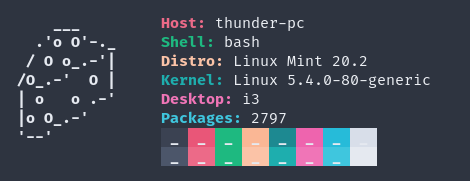

# Some of my scripts

## Shell scripts

### ild 
Stands for "interactive list display"(I know, not the best name), allows you to change directories easily on terminal.

### passwd_gen
Generates a password. Takes *password length* as commandline arument. \

#### Usage

    ./passwd_gen 13 (generates a password of 13 letters)

#### Problem
- Does not generate key with length:2 or 1

### updt
Script that runs **update, upgrade, autoremove, autoclean**

### Configs.sh
Script that creates a dialog box and access your custom list of config files to choose.

## Lua scripts

## Perl scripts

###Cheesefetch

Simple fetch tool written in bash. It was inspired from **pfetch**.

